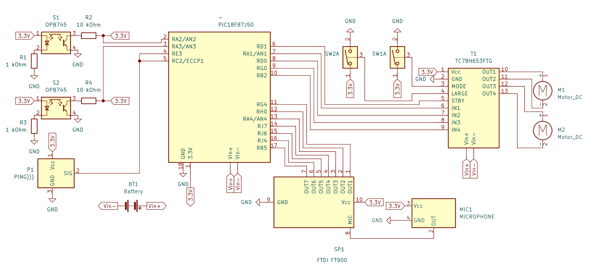

# Self-Driving Car Project

This project demonstrates the design and construction of a self-driving car prototype capable of following a track, avoiding obstacles, and initiating self-driving functions through voice commands. The car uses object reflectance sensors and an ultrasonic distance sensor, with a PIC18F87J50 microcontroller programmed in Assembly language to control the system.
For more information, read the report. 
## Table of Contents

- [Overview](#overview)
- [Features](#features)
- [Hardware](#hardware)
- [Software](#software)
- [Code Structure](#code-structure)
- [Electric Circuit Schematic](#electric-circuit-schematic)
- [Performance](#performance)

## Overview 

This project explores autonomous vehicle technology by building a car that can navigate an elliptical track autonomously and avoid head-on collisions. The prototype operates at SAE Level 3 automation and integrates various sensors and microprocessor-controlled motor drivers to manage steering, speed, and obstacle avoidance.

## Features 
- **Autonomous Navigation**: Uses reflectance sensors to follow a black track with white edges, mimicking road lanes.
- **Obstacle Detection**: Detects objects within a predefined range using an ultrasonic sensor and halts when an obstacle is too close.
- **Voice Activation**: The car can enter self-driving mode when prompted by a voice command using a SpeakUp 2 Click module.

## Hardware 

The project uses the following components:

- **PIC18F87J50 Microprocessor**: Manages all processing and control functions.
- **SpeakUp 2 Click**: Enables voice recognition to activate self-driving features.
- **DC Motor 19 Click**: Controls two motors for movement and turning.
- **OPB745 Reflectance Sensors**: Detect lane edges on the track.
- **PING))) Ultrasonic Sensor**: Detects obstacles ahead of the car.
- **4tronix Initio 4WD Chassis**: Provides a durable base with wheels, motors, and speed sensors.

## Software 

The car’s control logic is implemented in Assembly language and includes several key modules:

1. **Speech Recognition**: Activates self-driving mode upon voice command.
2. **Motor Control**: Controls movement and turning through various motor settings.
3. **Sensor Modules**: Reads data from reflectance and ultrasonic sensors to navigate the track and detect obstacles.

The source code for each module can be found in this repository.

## Code Structure 

- **main.s**: The Main module manages the setup of the motors and sensors, the speech recognition routine, the interrupt routine, and calls routines from other modules to enable sensor functionality.
- **Motors.s**: Operates the motors connected to the car's wheels, allowing for forward, reverse, and turning movements.
- **Reflective_sensors.s**: Manages the object reflectance sensors, interpreting lane boundaries to guide the car along the track.
- **CCP_Ping.s**: Sets up Capture, Compare, and Pulse-Width Modulation (CCP) functions and interrupt routines for the operation of the PING))) ultrasonic distance sensor.
- **Ping.s**: Operates the ultrasonic distance sensor to detect obstacles in the car’s path.
- **Delay.s**: Implements a 10ms delay to allow time for the reflected pulse from the ultrasonic sensor to be detected.

## Electric Circuit Schematic

## Performance 

- **Autosteer Success Rate**: 87%-100% depending on track conditions.
- **Obstacle Detection Success Rate**: 100% for obstacles over 15 x 10 cm directly in front of the sensor.
- **Speech Recognition Success Rate**: 60% in quiet environments.
- **Maximum Speed**: 0.17 m/s (with 6V power) or 0.11 m/s (with 4.5V power).
